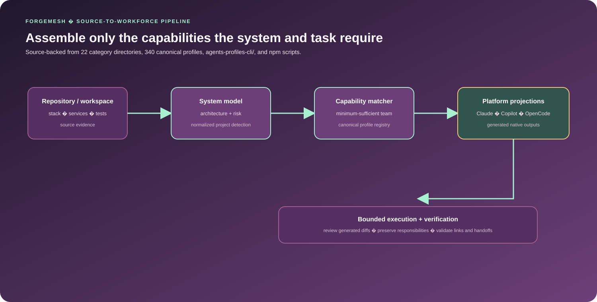
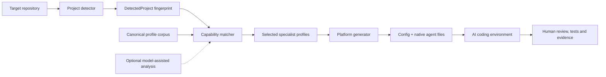

<div align="center">

# ForgeMesh Adaptive Engineering Workforce

**ForgeMesh turns repository signals into a reviewable specialist-workforce configuration for the engineering tools a project uses.**

</div>

ForgeMesh addresses a practical coordination problem: fixed AI-agent rosters do not reflect the languages, frameworks, infrastructure, tests or risks of the repository in front of them. This repository combines a canonical specialist-profile corpus with a TypeScript CLI that detects project signals, matches capabilities and generates platform-specific configuration.

The implemented product surface is a workforce setup and compilation tool. It does not claim to be a live autonomous engineering runtime; the generated profiles and handoff rules are inputs for supported AI coding environments.

## Get started

### Validate the canonical corpus

From the repository root:

```bash
npm run validate
```

This runs the checked-in [validate.sh](validate.sh) audit. It checks source-file counts, README links, required handoff and anti-pattern sections, personality metadata, native-agent slug duplication, slug conventions, native output counts and README metadata consistency.

### Build and inspect the CLI

The executable TypeScript package lives in [agents-profiles-cli](agents-profiles-cli):

```bash
cd agents-profiles-cli
npm ci
npm run typecheck
npm run build
node dist/bin/cli.js --help
node dist/bin/cli.js list
node dist/bin/cli.js detect ..
```

To configure a target project without network fetches, run the built CLI from that project's path:

```bash
node /path/to/ForgeMesh/agents-profiles-cli/dist/bin/cli.js init /path/to/target --yes --offline
```

The interactive init command can instead fetch specialist definitions from GitHub, select a target platform and generate the appropriate config. Deterministic project detection and catalog matching do not require an API key; model-assisted analysis is optional and requires the user's own compatible credentials.

## Why it is interesting

- **Evidence-driven matching:** the detector scans repository signals such as languages, frameworks, package managers, databases, queues, cloud providers, Docker/Kubernetes/Terraform, CI/CD, test frameworks, mobile/embedded/game surfaces, AI/ML and monitoring.
- **Minimum-sufficient composition:** the matcher starts with orchestration/reviewer foundations, then adds language, framework, infrastructure, data and quality specialists justified by the detected project.
- **Canonical-to-native compilation:** the root corpus is the source of truth; generated native files are projections for OpenCode, Claude and GitHub Copilot. The CLI also knows how to emit configs for Cursor, Windsurf, Aider, Continue, Generic and custom providers.
- **Offline and recoverable setup:** the CLI supports the offline flag, atomic writes and rollback-on-failure behavior, so configuration generation can be reviewed locally and does not depend on a model call.
- **Explicit responsibility contracts:** profiles contain descriptions, categories, optional permission levels/tools, handoff protocols and anti-pattern guidance. A profile is a capability definition, not a running agent.

<p align="center">
  
</p>

## Architecture



There are two maintained layers:

1. The root corpus contains 340 canonical source profiles across 22 category directories and generated native projections.
2. The nested CLI package is versioned separately as forgemesh 0.2.1 and contains a curated 144-profile catalog across 22 domains, detector/matcher logic, platform registry, generators and the init, list and detect command surface.

The two counts are intentionally not combined: native projections are not additional profiles, and the CLI catalog is a separate executable package rather than a claim that every root profile is compiled into that release.

## CLI workflow

```text
forgemesh init [directory]
  1. detect project languages, frameworks, data and infrastructure signals
  2. optionally apply model-assisted recommendations
  3. choose OpenCode, Claude, Copilot, Cursor, Windsurf, Aider,
     Continue, Generic or a custom provider
  4. select minimal, standard or complete specialist depth
  5. resolve profiles locally or fetch them when online
  6. generate platform config and specialist files
```

Useful commands:

| Command | Purpose |
|---|---|
| forgemesh init [dir] | Interactive project-aware setup |
| forgemesh init [dir] --yes | Non-interactive minimal setup |
| forgemesh init [dir] --yes --offline | Local/offline setup without GitHub fetches |
| forgemesh detect [dir] | Print the detected system fingerprint |
| forgemesh list | Show supported platform outputs |

## Code map

```text
business-analysis/ ... testing-quality/   Canonical profile categories
native-agents/                           Generated platform projections
native-agents/generate.py                Root corpus-to-native generator
validate.sh                              Corpus and metadata audit
agents-profiles-cli/src/cli.ts           CLI command and help surface
agents-profiles-cli/src/detectors/       Repository fingerprint detection
agents-profiles-cli/src/generators/      Profile selection and output generation
agents-profiles-cli/src/platforms/       Built-in platform registry
agents-profiles-cli/src/commands/        Interactive and non-interactive setup
agents-profiles-cli/templates/           Platform configuration templates
```

## Evidence and limitations

The root validation script verifies repository consistency; it does not prove that every profile is technically correct, that a selected workforce is optimal, or that a downstream AI platform will execute generated configuration without adaptation.

The CLI package has build and typecheck lanes but no claim here of a complete end-to-end test suite. Network fetching, optional model-assisted analysis and downstream platform behavior remain environment-dependent. Review generated diffs before committing them to a target project.

The project is best evaluated as a repository-intelligence and configuration-compilation tool: it detects signals, selects documented capabilities and generates handoff/configuration artifacts. It does not itself provide provider sessions, execute repository mutations or establish production readiness for a configured AI environment.

## Provenance and license

The root package.json still identifies the upstream repository as [CrimsonDevil333333/agents-profiles](https://github.com/CrimsonDevil333333/agents-profiles), and the root [LICENSE](LICENSE) retains its 2024 MIT copyright notice. The nested CLI declares MIT licensing and the ForgeMesh repository as its package home.

This README preserves that lineage rather than presenting the entire corpus as wholly original work. Preserve the retained notice and review contribution provenance before redistributing or materially rebranding the source corpus.

---

**Jason Lee**  
GitHub: [@Masterleeaus](https://github.com/Masterleeaus)
